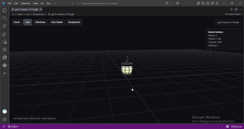
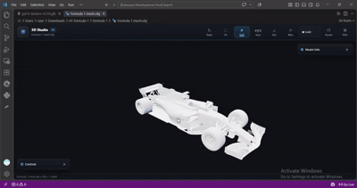
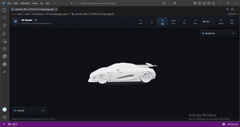

# 3D Studio 🎨

**3D Studio** is a professional 3D model viewer extension for Visual Studio Code. It lets you open and inspect **GLB, GLTF, OBJ, and STL** 3D models directly inside VS Code without leaving your development environment.

## 🚀 Why 3D Studio?

Working with 3D models often means switching between code editors and external 3D applications. **3D Studio** brings essential 3D viewing tools directly into Visual Studio Code, providing a clean and focused workspace for developers working with 3D assets.

Whether you are developing a game, web application, 3D project, or simply inspecting a model, **3D Studio** gives you a convenient viewport directly inside your editor.

## ✨ Features

- **Multi-Format Support:** Open `GLB`, `GLTF`, `OBJ`, and `STL` files directly inside VS Code.
- **Interactive 3D Viewport:** Rotate, pan, and zoom around your model using the mouse.
- **Grid:** Toggle a professional viewport grid for better spatial reference.
- **Axes:** Display XYZ axes to understand model orientation.
- **Bounding Box:** Show the model's bounding box for quick spatial inspection.
- **Wireframe:** Toggle wireframe visualization to inspect model topology.
- **View Modes:** Switch between **Solid**, **Wireframe**, and **X-Ray** viewing modes.
- **Auto Rotate:** Automatically rotate the model for convenient asset previews.
- **Fit Model:** Quickly frame the complete model inside the viewport.
- **Reset Camera:** Restore the default camera position.
- **Model Information:** View mesh, vertex, triangle, material, texture, and dimension information.
- **Screenshot:** Capture the viewport and save it as a PNG image.
- **Collapsible Panels:** Keep Controls and Model Info panels organized and out of the way when not needed.
- **Professional UI:** A modern dark 3D-editor interface designed to work naturally inside VS Code.
- **Read-Only Model Viewer:** View your assets without modifying the original 3D files.

## 🛠️ How to Use

1. **Install** the extension.
2. Open a supported 3D model file:
   - `.glb`
   - `.gltf`
   - `.obj`
   - `.stl`
3. The model will open automatically in **3D Studio**.
4. Use the toolbar to:
   - Reset the camera
   - Fit the model
   - Toggle Grid
   - Toggle Axes
   - Toggle Bounding Box
   - Toggle Wireframe
   - Change View Mode
   - Enable Auto Rotate
   - Save a PNG screenshot
5. Use the mouse to interact with the model:
   - **Left drag:** Rotate
   - **Right drag:** Pan
   - **Scroll:** Zoom

## ⌨️ Keyboard Shortcuts

| Shortcut | Action |
| :--- | :--- |
| `R` | Reset camera |
| `F` | Fit model |
| `G` | Toggle grid |
| `W` | Toggle wireframe |
| `A` | Toggle auto rotate |

## 📦 Supported Formats

| Format | Support |
| :--- | :--- |
| `.glb` | ✅ Supported |
| `.gltf` | ✅ Supported |
| `.obj` | ✅ Supported |
| `.stl` | ✅ Supported |

## 📊 Model Information

The **Model Info** panel provides useful information about the currently loaded model:

- Number of meshes
- Number of vertices
- Number of triangles
- Number of materials
- Number of textures
- Model dimensions
- X, Y, and Z size

## 📸 Screenshot

Use the **PNG** button in the toolbar to capture the current 3D viewport.

3D Studio will open a save dialog so you can choose where to save the screenshot.

## 🏗️ Project Structure

The project is built with a modular architecture for performance and future development:

- `src/extension.ts`: Handles VS Code activation, custom editor integration, Webview creation, and communication with the viewer.
- `media/viewer.ts`: Main 3D viewer controller and feature integration.
- `media/core/`: Three.js scene, camera, renderer, and lighting.
- `media/loaders/`: GLB/GLTF, OBJ, and STL model loading.
- `media/features/`: Independent viewport features such as grid, axes, wireframe, auto-rotate, bounding box, screenshot, and view modes.
- `media/ui/`: Toolbar, statistics panel, status bar, collapsible panels, and viewer styling.
- `media/utils/`: Model statistics, model utilities, and keyboard shortcut helpers.

The architecture is designed so that additional 3D Studio features can be added in future phases without unnecessarily changing existing functionality.

## 🔒 Stability & Security

**3D Studio** is built using the official **VS Code Custom Editor and Webview APIs**.

The extension:

- Runs the 3D viewer inside VS Code.
- Uses a bundled Three.js viewer.
- Does not require an external 3D application.
- Keeps supported model files read-only while viewing.
- Uses local extension resources for the viewer interface.

## 📋 Current Release

### Phase 3A

The current release focuses on a professional 3D viewing experience with:

- 3D model loading
- Multiple model formats
- Interactive camera controls
- Grid and axes
- Wireframe
- Bounding box
- Solid / Wireframe / X-Ray view modes
- Auto rotation
- Model statistics
- Screenshot export
- Professional toolbar
- Collapsible Controls and Model Info panels

Additional features are planned for future development phases.

## 🤝 Contributing

Suggestions and contributions are welcome!

If you find a bug, have a feature request, or have an idea for improving **3D Studio**, feel free to open an issue or submit a pull request.

Future feature ideas may include additional object interaction, scene management, advanced materials, animation tools, measurements, and other professional 3D viewport capabilities.

---

### Connect with me

- **LinkedIn**: [Rakesh Chauhan](https://www.linkedin.com/company/parivartya/?viewAsMember=true) - Professional updates
- **Instagram**: [mr.rkchauhan](https://www.instagram.com/mr.rkchauhan/) - Follow and Contact us.
- **YouTube**: [Parivartya Programming](https://www.youtube.com/channel/UCj7XiHMAQPYD0o7_X0tjy_A) - Video tutorials
- **Website**: [Parivartya Corporation](https://parivartya.in) - Also visit the site

---

**Happy 3D Viewing!** 🚀